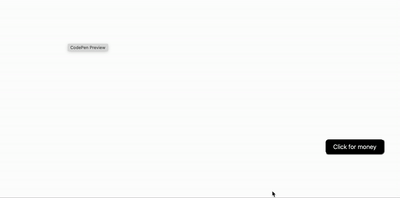

# movingButton
A button that moves when you try to click on it. Try to catch it, count how many times it moves, and enjoy the challenge. It’s simple. It’s fun. It’s a button. That moves. So its not a real 'button' I guess.

### What people are saying:
**Mom** 
> "I didn't want people to click on my facebook profile. This button saves me"

**Dad** 
> "Why did he make this? It serves no purpose"
